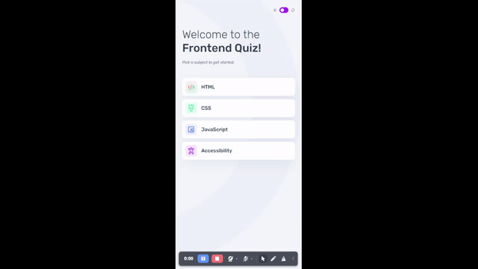

## Table of Contents

- [Overview](#overview)
  - [Figma Design](#figma-design)
  - [Outcome](#outcome)
- [Technologies](#technologies)
- [Features](#features)

## Overview

### Figma Design

<p align="center">

</p>

### Outcome

<p align="center">

</p>

## Technologies

The technologies used in this project are:

* HTML & Tailwind & TypeScript
* Angular (core, animation, angular-fire)

## Features

* **Responsive Design**: Ensures the App looks great on all devices.
* **Accessibility**: Built with accessibility in mind.
* **Animations**: Smooth animations for all app interactions.

## Setup

To run this app in development mode open the terminal and write the following:

```shell  
git clone https://github.com/BennyChrispin/Frontend-Quiz.git 
npm install

# you need to install angular cli to run this app in development mode
npm install -g @angular/cli

ng serve
```

## Links

* [Live Demo](https://frontend-quiz-seven.vercel.app/)


## License

Copyright (c) 2024, Benny Chrispin
